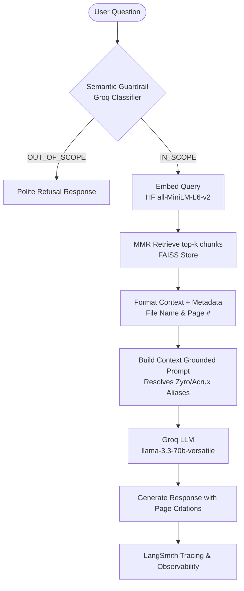

# RAG Assistant Masterclass Portfolio 🏢🚀

Welcome to the **RAG Assistant Masterclass Portfolio**! This repository is a comprehensive showcase of building, optimizing, and deploying production-grade **Retrieval-Augmented Generation (RAG)** systems. 

It contains multiple projects, hands-on labs, and learning resources covering semantic search, LLM orchestration, evaluation tracing, and premium front-end interfaces.

---

## 📂 Repository Structure

The repository is structured as a monorepo containing:

*   **[`zyro-rag-challenge/`](file:///c:/Rag%20Assistant%20masterclass/zyro-rag-challenge)**: The flagship project—a production-ready HR AI Help Desk for **Zyro Dynamics** featuring semantic guardrails, MMR retrieval, and a premium glassmorphic Streamlit UI.
*   **[`langchain-rag-nxtwave-main/`](file:///c:/Rag%20Assistant%20masterclass/langchain-rag-nxtwave-main)**: A developer API Documentation Assistant demonstrating LangChain and LangGraph fundamentals, document loading, and vector database management (Chroma).
*   **[`zyro-dynamics-hr-corpus/`](file:///c:/Rag%20Assistant%20masterclass/zyro-dynamics-hr-corpus)**: The official internal PDF corpus (Employee Handbook, Leave Policies, POSH, WFH Policies) used to ground the HR Assistant.
*   **[`notes/`](file:///c:/Rag%20Assistant%20masterclass/notes)**: Detailed technical notes documenting key design patterns, evaluation strategies, and enterprise RAG concepts.
*   **[`linkedin_posts/`](file:///c:/Rag%20Assistant%20masterclass/linkedin_posts)**: Developer updates and walkthroughs sharing learnings from the masterclass.

---

## 🏢 Project 1: Zyro Dynamics HR AI Help Desk (Kaggle RAG Challenge)

An AI-powered chatbot designed to resolve internal HR policy questions for employees of **Zyro Dynamics**. The system is optimized for high accuracy, citation grounding, and strict domain compliance.

### 🛠️ Architecture & Data Flow



### ✨ Core Features
1.  **Groq-Powered Generation**: Leverages `llama-3.3-70b-versatile` for lightning-fast, highly accurate responses.
2.  **Semantic Guardrails**: Pre-classifies incoming user queries using a dynamic LLM prompt to identify out-of-scope or competitor questions (e.g., questions about Zoho/Salesforce policies or company revenue) and blocks them instantly.
3.  **FAISS Vector Database**: Uses HuggingFace's `all-MiniLM-L6-v2` embeddings combined with **Maximal Marginal Relevance (MMR)** search to retrieve diverse, relevant chunks while avoiding redundancy.
4.  **Citations & Metadata Grounding**: Automatically appends source document titles and page numbers to response chunks.
5.  **Premium Glassmorphic UI**: A gorgeous Streamlit dashboard featuring custom dark mode styling, linear gradients, real-time performance stats, and a clean chat history interface.

---

## 📖 Project 2: LangChain API Documentation Assistant

A development-focused assistant designed to help software engineers navigate and query technical API documentation.

### ✨ Core Features
*   **Chroma DB Integration**: Stores and queries chunked Markdown developer guides.
*   **Interactive Notebooks**: Includes `Handson_lab1.ipynb` showcasing document loading, recursive chunking, and similarity searches.
*   **Streamlit Developer Interface**: A lightweight UI designed for rapid testing of retrieval configurations and model temperatures.

---

## ⚡ Getting Started Locally

### Prerequisites
*   Python 3.9+
*   Groq API Key (Get a free key at [console.groq.com](https://console.groq.com))
*   LangSmith API Key (Get a free key at [smith.langchain.com](https://smith.langchain.com))

### 1. Clone & Install Dependencies
```bash
git clone https://github.com/dewanshu0311/Rag-Assistant-masterclass.git
cd Rag-Assistant-masterclass
pip install -r zyro-rag-challenge/requirements.txt
```

### 2. Configure Environment Variables
Create a `.env` file inside the `zyro-rag-challenge/` directory:
```env
GROQ_API_KEY=your_groq_api_key
LANGCHAIN_API_KEY=your_langsmith_api_key
LANGCHAIN_TRACING_V2=true
LANGCHAIN_PROJECT=zyro-rag-challenge
```

### 3. Run the HR Help Desk Application
```bash
cd zyro-rag-challenge
streamlit run app.py
```

---

## ☁️ Deploying to Streamlit Community Cloud

To deploy the **Zyro Dynamics HR Help Desk** online:
1.  Log in to [Streamlit Share](https://share.streamlit.io/).
2.  Click **New app** and connect your GitHub repository (`dewanshu0311/Rag-Assistant-masterclass`).
3.  Set the directory branch to `main` and the main file path to `zyro-rag-challenge/app.py`.
4.  Open **Advanced settings** and add your secrets:
    ```toml
    GROQ_API_KEY = "your_groq_api_key"
    LANGCHAIN_API_KEY = "your_langsmith_api_key"
    LANGCHAIN_TRACING_V2 = "true"
    LANGCHAIN_PROJECT = "zyro-rag-challenge"
    ```
5.  Click **Deploy**!

---

## 🏆 Kaggle Competition Submission

The evaluation notebook uses your deployed app and LangSmith logs to verify pipeline behavior:
1.  Add your public **Streamlit App URL** and **LangSmith Trace URL** in the Kaggle notebook.
2.  Run the evaluation loop to check pipeline accuracy across all test questions.
3.  Generate the final `submission.csv` to secure your score on the leaderboard.
