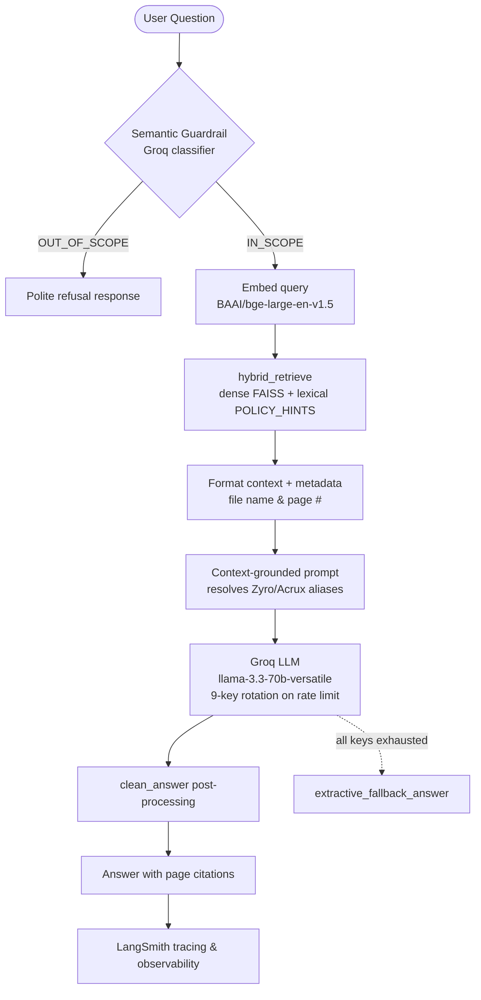

<div align="center">

# 🏢 RAG Assistant Masterclass

### Zyro Dynamics HR AI Help Desk — Kaggle RAG Challenge

[](https://python.org)
[](https://groq.com)
[](https://huggingface.co/BAAI/bge-large-en-v1.5)
[](https://github.com/facebookresearch/faiss)
[](https://langchain.com)
[](https://streamlit.io)

**A production-grade Retrieval-Augmented Generation system: an HR help desk that answers
policy questions from a grounded PDF corpus, refuses out-of-scope questions at the door,
and cites the document and page it got every answer from.**

[Architecture](#️-architecture--data-flow) · [Features](#-core-features) · [Run it](#-getting-started-locally) · [Deploy](#️-deploying-to-streamlit-community-cloud)

</div>

---

This repository showcases building, optimizing, and deploying production-grade
**Retrieval-Augmented Generation (RAG)** systems. 

It centres on a production-grade HR help desk built for the Kaggle RAG Challenge, covering semantic
guardrails, hybrid retrieval, citation grounding, evaluation tracing, and a polished Streamlit front end.

---

## 📂 Repository Structure

The repository is a monorepo containing:

*   **[`zyro-rag-challenge/`](zyro-rag-challenge)** — the flagship project: a production-ready HR AI Help Desk for **Zyro Dynamics** featuring semantic guardrails, hybrid retrieval, a prebuilt FAISS index, and a glassmorphic Streamlit UI.
*   **[`zyro-dynamics-hr-corpus/`](zyro-dynamics-hr-corpus)** — the internal PDF corpus (Employee Handbook, Leave Policy, WFH Policy, POSH, Code of Conduct and more) used to ground the assistant, plus the starter notebook.

---

## 🏢 Project 1: Zyro Dynamics HR AI Help Desk (Kaggle RAG Challenge)

An AI-powered chatbot designed to resolve internal HR policy questions for employees of **Zyro Dynamics**. The system is optimized for high accuracy, citation grounding, and strict domain compliance.

### 🛠️ Architecture & Data Flow



### ✨ Core Features
1.  **Groq-Powered Generation**: Leverages `llama-3.3-70b-versatile` for lightning-fast, highly accurate responses.
2.  **Semantic Guardrails**: Pre-classifies incoming user queries using a dynamic LLM prompt to identify out-of-scope or competitor questions (e.g., questions about Zoho/Salesforce policies or company revenue) and blocks them instantly.
3.  **Hybrid Retrieval over FAISS**: `BAAI/bge-large-en-v1.5` embeddings in a prebuilt FAISS index, combined by `hybrid_retrieve()` with a domain-specific lexical pass (`POLICY_HINTS`) so policy-specific wording is not lost to pure vector similarity.
4.  **Resilient generation**: nine-key Groq rotation on rate-limit errors, with an `extractive_fallback_answer()` path so the app degrades to a grounded extract instead of failing when every key is exhausted.
5.  **Citations & Metadata Grounding**: Automatically appends source document titles and page numbers to response chunks.
6.  **Premium Glassmorphic UI**: A Streamlit dashboard featuring custom dark-mode styling, linear gradients, real-time performance stats, and a clean chat-history interface.

---

## ⚡ Getting Started Locally

### Prerequisites
*   Python 3.9+
*   Groq API Key (Get a free key at [console.groq.com](https://console.groq.com))
*   LangSmith API Key (Get a free key at [smith.langchain.com](https://smith.langchain.com))

### 1. Clone & Install Dependencies
```bash
git clone https://github.com/dewanshu0311/Rag-Assistant-masterclass.git
cd Rag-Assistant-masterclass
pip install -r zyro-rag-challenge/requirements.txt
```

### 2. Configure Environment Variables
Create a `.env` file inside the `zyro-rag-challenge/` directory:
```env
GROQ_API_KEY=your_groq_api_key
LANGCHAIN_API_KEY=your_langsmith_api_key
LANGCHAIN_TRACING_V2=true
LANGCHAIN_PROJECT=zyro-rag-challenge
```

### 3. Run the HR Help Desk Application
```bash
cd zyro-rag-challenge
streamlit run app.py
```

---

## ☁️ Deploying to Streamlit Community Cloud

To deploy the **Zyro Dynamics HR Help Desk** online:
1.  Log in to [Streamlit Share](https://share.streamlit.io/).
2.  Click **New app** and connect your GitHub repository (`dewanshu0311/Rag-Assistant-masterclass`).
3.  Set the directory branch to `main` and the main file path to `zyro-rag-challenge/app.py`.
4.  Open **Advanced settings** and add your secrets:
    ```toml
    GROQ_API_KEY = "your_groq_api_key"
    LANGCHAIN_API_KEY = "your_langsmith_api_key"
    LANGCHAIN_TRACING_V2 = "true"
    LANGCHAIN_PROJECT = "zyro-rag-challenge"
    ```
5.  Click **Deploy**!

---

## 🏆 Kaggle Competition Submission

The evaluation notebook uses your deployed app and LangSmith logs to verify pipeline behavior:
1.  Add your public **Streamlit App URL** and **LangSmith Trace URL** in the Kaggle notebook.
2.  Run the evaluation loop to check pipeline accuracy across all test questions.
3.  Generate the final `submission.csv` to secure your score on the leaderboard.
